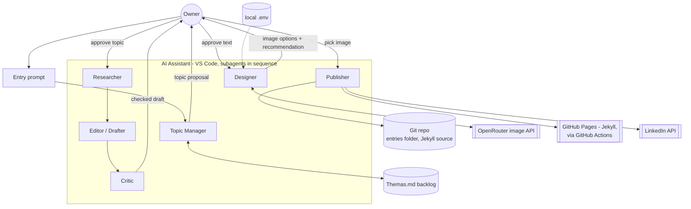
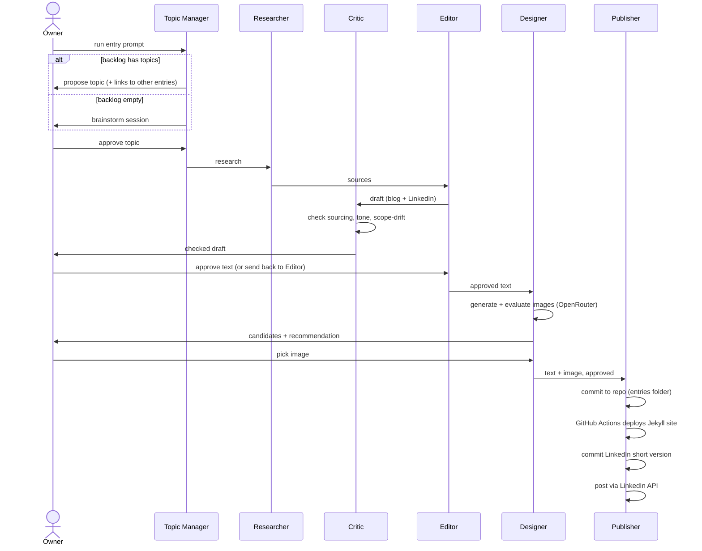

# HLD.md — High Level Design

High-level architecture for the pipeline described in
[Customer_requirements.md](Customer_requirements.md). Component names here
are provisional and should stay aligned with the agent roster in
[Concept.md](Concept.md) §Agents & roles.

## Actors

- **Owner** — approves topic, text, and image at each gate.
- **AI Assistant** — runs inside VS Code, orchestrates every component below.

## Component diagram

## Sequence of one entry

## Components

| Component | Responsibility | Gate before it runs |
|---|---|---|
| Topic Manager | Reads `Themas.md`, proposes or brainstorms a connected topic | none — is the entry point |
| Researcher | Gathers/verifies sources for the approved topic | topic approved |
| Editor | Drafts blog (long) + LinkedIn (short) per AGENTS.md §3/§5 | none, runs after research |
| Critic | Checks sourcing/tone/scope-drift before owner sees it | draft written |
| Designer | Generates & shortlists images via OpenRouter, gives a recommendation | text approved |
| Publisher | Commits entry to repo, deploys blog via Actions, posts to LinkedIn | image approved |

## Data stores / external systems

- `Themas.md` — raw topic backlog (read/write by Topic Manager).
- Repo entries folder — canonical source of truth for every published entry
  (both formats + chosen image), Jekyll source. Layout: AGENTS.md §8.
- Image-gen API — **OpenRouter** (`OPENROUTER_API_KEY`), model pinned via
  `OPENROUTER_IMAGE_MODEL` in `.env` (currently `openai/gpt-image-2.5-sunburst`).
  Went through two prior attempts during the M5 pilot before landing here
  (decided 2026-09-14): OmniRoute broker (all three of its own proxied
  models failed — OpenRouter account limit, broken Gemini route,
  unsupported Codex-routed model), then direct Gemini API (key
  authenticated but the project had zero image-gen quota). Owner switched
  to calling OpenRouter directly with a specific model instead.
- GitHub Pages — Jekyll blog, deployed via a **GitHub Actions** workflow
  triggered on merge to main.
- LinkedIn — posting target for the short-form version, via the
  **LinkedIn API** (automated, direct — no MCP). Requires a LinkedIn
  Developer app with `w_member_social` scope; OAuth token stored in the
  local `.env` alongside the OpenRouter key.

## Decided

- Multi-agent split, orchestrated as subagent types dispatched in sequence
  from one driving session (Topic Manager / Researcher / Critic / Editor /
  Designer / Publisher) — not a `Workflow`-tool pipeline.
- Designer uses the OpenRouter image API, key (`OPENROUTER_API_KEY`) and
  pinned model (`OPENROUTER_IMAGE_MODEL`) in local `.env` (changed from
  OmniRoute, then a direct-Gemini attempt, decided 2026-09-14 — see
  "Data stores / external systems" above).
- Site generator: Jekyll.
- Critic pass added before the draft reaches the owner.
- Publisher posts to LinkedIn via the LinkedIn API (direct, no MCP).
  Absolute last step of the pipeline — requires a separate, explicit owner
  go-ahead right before posting, distinct from the text/image approval
  gates (Customer_requirements.md, decided 2026-09-14).
- Publisher deploys the blog via a GitHub Actions workflow.
- Cadence: ad hoc, owner-initiated — no recurring trigger.
- Research sourcing: open web search, no fixed allowlist.
- Repo stores both formats as separate files per entry (no generate-at-
  publish step).
- Hosting mode (decided 2026-09-14): GitHub Pages **project site**
  (`deadlockua.github.io/Learn_with_me_Digest`), no custom domain yet. Owner
  intends to migrate to a custom domain later — scaffold should avoid
  hard-coding the project-site path so that migration only needs adding a
  `CNAME` file + DNS records, not editing content/links.
- Theme (decided 2026-09-14): `minima` (stock GitHub Pages-supported theme).

## Remaining build tasks (decided, not blocking on further owner input)

- Agent roster (M4, 2026-09-14): all six roles built as
  `.claude/agents/*.md` (topic-manager, researcher, editor, critic,
  designer, publisher) plus an orchestrating Skill
  (`.claude/skills/digest-entry/SKILL.md`) that dispatches them in
  sequence and stops at the four approval gates. Structurally dry-run
  verified (frontmatter parses, Skill references all six agent names) —
  not yet exercised end to end with real content; that's M5.
- Owner: create LinkedIn Developer app, get `w_member_social` scope,
  complete OAuth, store token in `.env`.
- GitHub Actions workflow file for Jekyll deploy: written and merged to
  main (`.github/workflows/deploy.yml`, M3). First real deploy succeeded
  2026-09-14 — site live at https://deadlockua.github.io/Learn_with_me_Digest/.
- Repo visibility: changed private → **public** (2026-09-14, owner
  decision) — required to unblock GitHub Pages, which the account's plan
  doesn't support on private repos. History checked for secrets before the
  switch; none found.

## Out of scope / open

None outstanding — remaining work is build tasks, see above.
